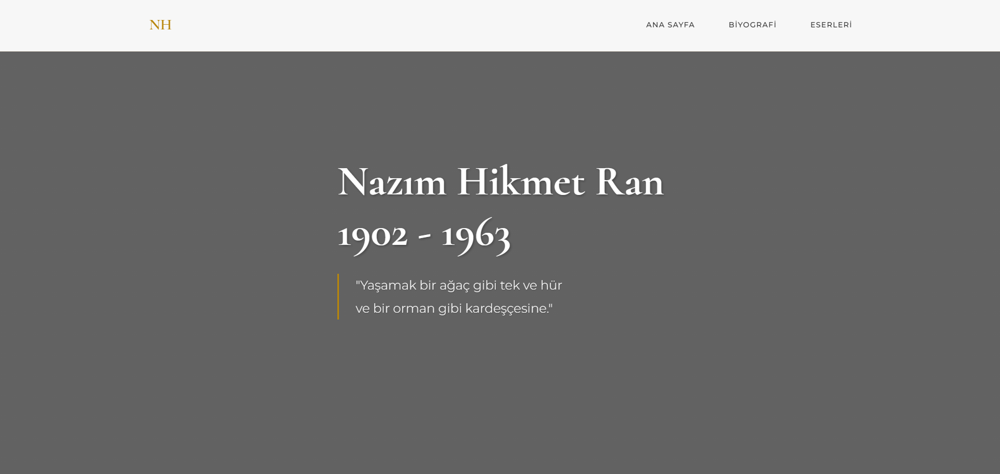
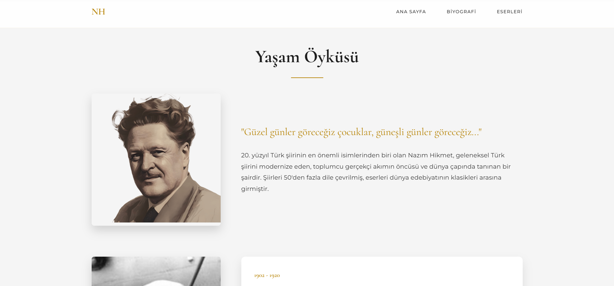
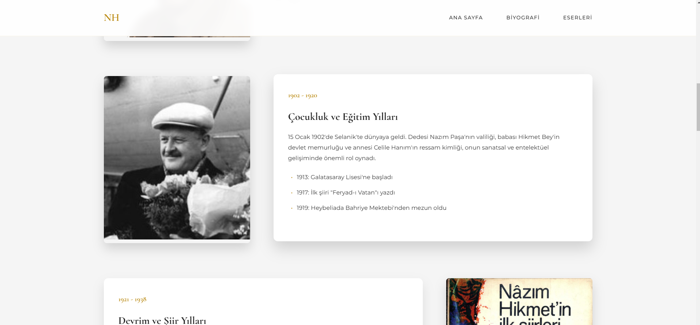
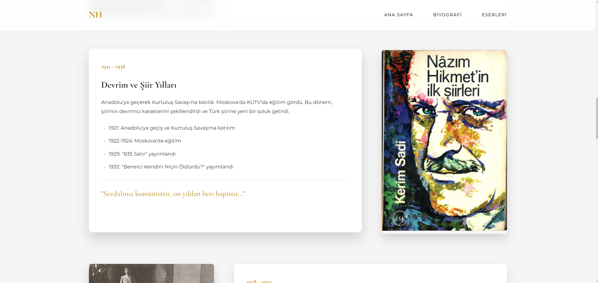
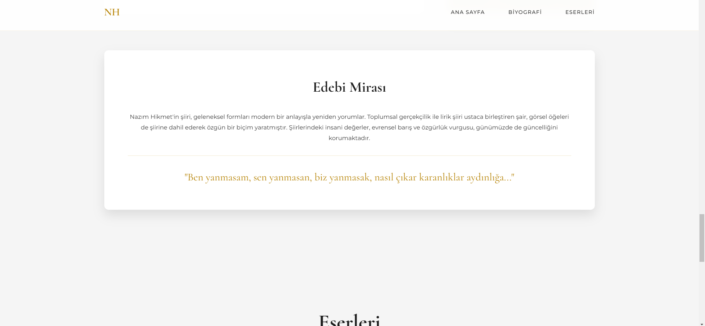
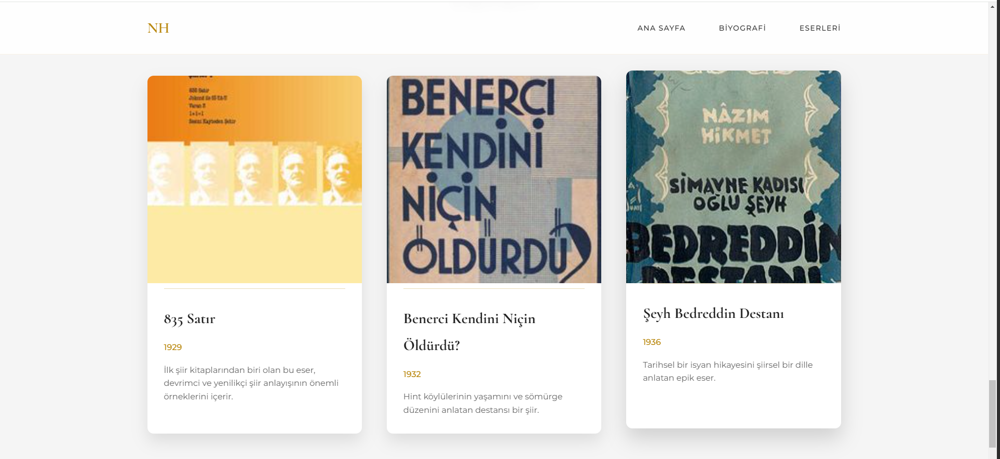

# Nazım Hikmet Tribute Page | Nazım Hikmet Anma Sayfası

[English](#english) | [Türkçe](#türkçe)

## Screenshots | Ekran Görüntüleri


*Hero Section with Parallax Effect | Paralaks Efektli Giriş Bölümü*


*Biography Introduction | Biyografi Giriş Bölümü*


*Interactive Timeline | Etkileşimli Zaman Çizelgesi*


*Detailed Biography Section | Detaylı Biyografi Bölümü*


*Works Display Grid | Eserler Gösterim Izgarası*


*Mobile Responsive Design | Mobil Uyumlu Tasarım*

## English

### About the Project
A modern and responsive tribute website dedicated to the renowned Turkish poet Nazım Hikmet. This project was created as part of a literary figures course assignment, showcasing the life and works of the poet through an interactive and visually appealing design.

### Features
- **Responsive Design**: Fully responsive layout that works on all devices
- **Modern UI Elements**:
  - Parallax scrolling effects
  - Smooth animations
  - Interactive timeline
  - Dynamic navigation
- **Content Sections**:
  - Hero section with signature quote
  - Detailed biography with timeline
  - Works showcase with hover effects
  - Chronological life events
  - Notable works grid

### Technical Details
- **Languages Used**:
  - HTML5
  - CSS3
- **Key Features**:
  - CSS Grid and Flexbox for layouts
  - CSS Variables for theming
  - CSS Animations and Transitions
  - Media Queries for responsiveness
- **Fonts**:
  - Cormorant (headers)
  - Montserrat (body text)
- **Color Scheme**:
  - Primary: Gold (#B8860B)
  - Background: Cream (#F5F5F5)
  - Text: Dark (#1C1C1C)

### Installation and Usage
1. Clone the repository
```bash
git clone https://github.com/ahmetemreari/TributeWebsite.git
```
2. Open `index.html` in your browser

## Türkçe

### Proje Hakkında
Ünlü Türk şairi Nazım Hikmet'e adanmış modern ve duyarlı bir anma websitesi. Bu proje, edebi figürler dersi ödevi kapsamında, şairin hayatını ve eserlerini interaktif ve görsel açıdan etkileyici bir tasarımla sunmak için oluşturulmuştur.

### Özellikler
- **Duyarlı Tasarım**: Tüm cihazlarda çalışan tam uyumlu düzen
- **Modern UI Öğeleri**:
  - Paralaks kaydırma efektleri
  - Yumuşak animasyonlar
  - Etkileşimli zaman çizelgesi
  - Dinamik navigasyon
- **İçerik Bölümleri**:
  - İmza alıntısı ile hero bölümü
  - Zaman çizelgeli detaylı biyografi
  - Hover efektli eserler vitrini
  - Kronolojik yaşam olayları
  - Önemli eserler ızgarası

### Teknik Detaylar
- **Kullanılan Diller**:
  - HTML5
  - CSS3
- **Temel Özellikler**:
  - Düzenler için CSS Grid ve Flexbox
  - Tema için CSS Değişkenleri
  - CSS Animasyonları ve Geçişleri
  - Duyarlılık için Medya Sorguları
- **Yazı Tipleri**:
  - Cormorant (başlıklar)
  - Montserrat (gövde metni)
- **Renk Şeması**:
  - Ana Renk: Altın (#B8860B)
  - Arkaplan: Krem (#F5F5F5)
  - Metin: Koyu (#1C1C1C)

### Kurulum ve Kullanım
1. Depoyu klonlayın
```bash
git clone https://github.com/kullaniciadin/TributeWebsite.git
```
2. `index.html` dosyasını tarayıcınızda açın

## License | Lisans
MIT License | MIT Lisansı

## Contributing | Katkıda Bulunma
Pull requests are welcome. | Pull request'lere açığız.

## Contact | İletişim
Project Link | Proje Bağlantısı: [https://github.com/ahmetemreari/TributeWebsite](https://github.com/ahmetemreari/TributeWebsite)
